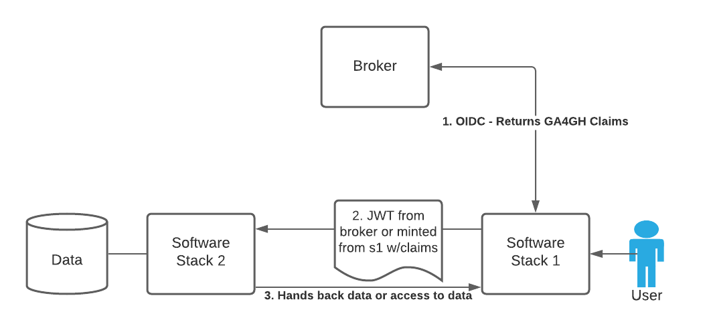

### Can the output of `/userinfo` be used as a JWT for Authentication?

The spec says that `/userinfo` may be formatted as a JWT. A Clearinghouse that
sends an access token to a `/userinfo` endpoint might get either JSON or a
formatted and signed JWT from a broker. The JWT can be used downstream as
an authentication mechanism if downstream services like Clearinghouses
support it and know what to do with it. 

It is probable that a special token endpoint will exist in a future
version of this profile that should prevent the `/userinfo` endpoint
from being overloaded.

### Can a JWT alone be used for authentication even if the spec mostly talks about OIDC Flow?

Yes. This specification allows for groups to organize themselves in many ways. 

A trusted group of Brokers and Claims Clearinghouses are permitted to
format `/userinfo` output as a JWT and use that as a means of how their
services communicate. They can also take `/userinfo` JSON output and
format it through some other means into a JWT. Proper due-diligence and
handling of tokens must be followed.

This specification does not prohibit services from using JWTs as authentication
outside of an OIDC flow.

An example: Two different stacks of software all have a similar user-base and
often use the same shared data resource -- a biobank, for instance. The User
authenticates with Biobank Broker on Software stack S1 and gets `/userinfo` output
as a JWT. The JWT includes GA4GH Passport Visas for a Dataset that the Broker holds
permissions for. S1 might not hold the data, S2 might hold the data. The User may
be allowed to bring that JWT to Software Stack S2 and get data authorized by the
claim in the JWT and held by S2, provided that S2 can trust S1 as a valid and
trustworthy client. 

 This enables two or more software stacks to work together more fluidly than having
 the same user authenticate twice across two stacks to access the same data. There
 is an assumption that these two software stacks have agreements and risk assessment
 in place in order to make this a secure method of authentication and that the User
 is aware that they are exchanging information with another stack without
 explicit OIDC-style consent.  

 